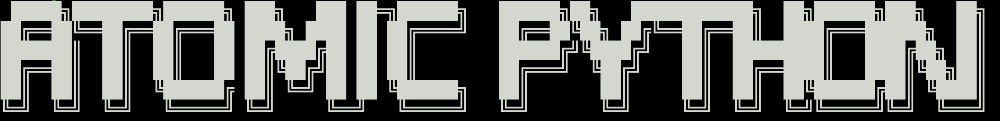

<p align="center">
  <a href="" rel="noopener">
 </a>
</p>

<div align="center">

[](https://github.com/S4TURN0/atomic-python)


</div>

---

### Descrição <a name = "Instalação"></a>

Ferramenta Python com o propósito de automatizar o processo inicial de reconhecimento em bug bounty e pentests.

### Instalação

Clone o repositório e realize a instalação das bibliotecas necessárias para o funcionamento da ferramenta
```
git clone https://github.com/S4TURN0/atomic-python.git; pip3 install -r ./atomic-python/requirements.txt
```

### Atomic Helper

```
usage: ./atomic-python.py [-h] [-a] [-d DESTINO] [-s] [-pS] [-p PORTA] [-f [FUZZING]] [-hc HC] [-sc SC] [-w W]

optional arguments:
  -h, --help    show this help message and exit
  -a, --auto    Automatiza todo o processo de discovery, scanning e web fuzzing
  -d DESTINO    Insira o endereço de destino (Domínio ou IPV4)

Subdomain arguments:
  -s, --subs    Realizar descoberta de subdominios

Portscan arguments:
  -pS, --scan   Realizar escaneamento de portas
  -p PORTA      Insira a porta para ser escaneada

Web Fuzzing arguments:
  -f [FUZZING]  Realizar descoberta de diretórios acessiveis
  -hc HC        Para especificar os códigos HTTP que deseja esconder
  -sc SC        Para especificar os códigos HTTP que deseja mostrar
  -w W          Adicionar uma wordlist para a realização do fuzzing (Padrão: common.txt)
```